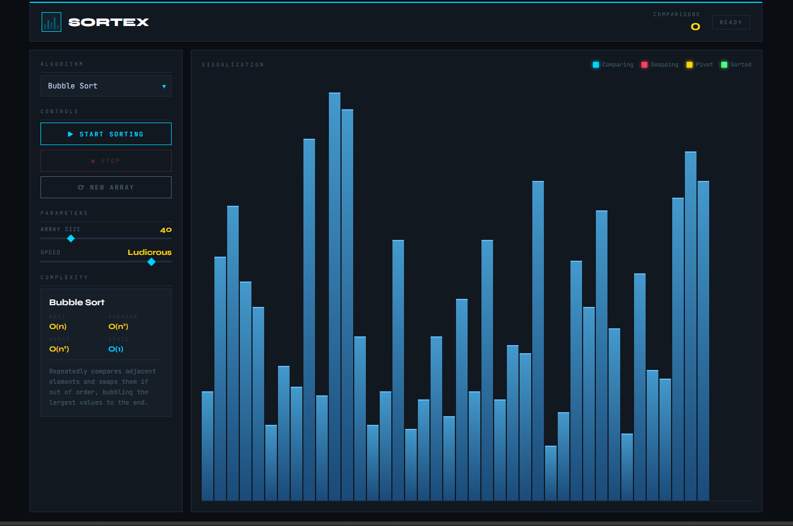
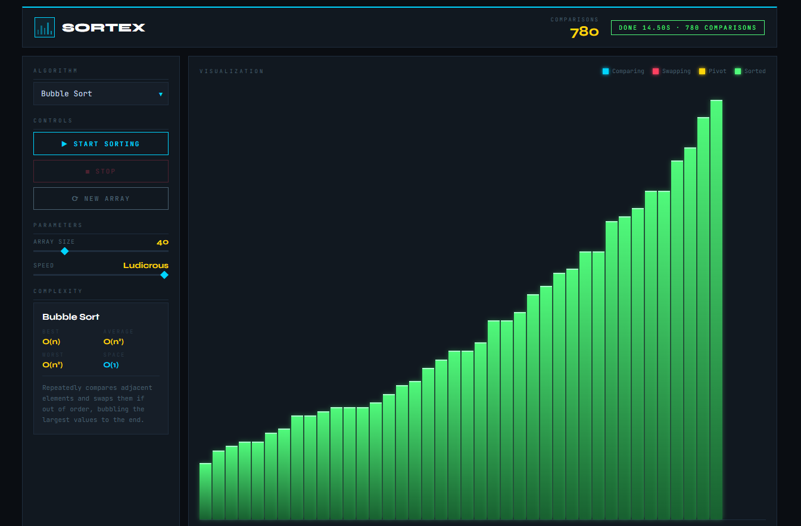

# SORTEX – Sorting Algorithm Visualizer

SORTEX is an interactive web application that visually demonstrates how different sorting algorithms work in real time.
Users can control the array size, visualization speed, and algorithm selection while observing step-by-step comparisons and swaps.

The project helps build intuition for sorting algorithms through animated bar visualizations.

## Features

* Interactive sorting visualization
* Real-time comparisons counter
* Adjustable **array size**
* Adjustable **sorting speed**
* Step-by-step algorithm animation
* Modern dark themed UI

## Implemented Algorithms

* Bubble Sort
* Selection Sort
* Insertion Sort
* Merge Sort
* Quick Sort

Each algorithm highlights:

* Comparisons
* Swaps
* Pivot elements (Quick Sort)
* Sorted elements

## Technologies Used

* **HTML5**
* **CSS3**
* **JavaScript (Vanilla JS)**

## Preview

Visualization of the sorting process:

### Before Sorting

### After Sorting

## Visualization Explanation

Each vertical bar represents a number in the array.

* The **height of the bar** represents the value of that number.
* Taller bars represent **larger values**.
* Shorter bars represent **smaller values**.

During sorting, the bars move as the algorithm compares and swaps values until the entire array becomes sorted.

Colors represent different actions during sorting:

* 🔵 Comparing
* 🔴 Swapping
* 🟡 Pivot element
* 🟢 Sorted element

## Purpose of the Project

This project was built to help understand sorting algorithms visually and improve algorithm intuition through interactive animations.

It can be useful for:

* Students learning Data Structures & Algorithms
* Visual demonstrations of sorting algorithms
* Understanding algorithm behavior step by step

## Future Improvements

Possible enhancements:

* Heap Sort
* Radix Sort
* Algorithm comparison mode
* Performance graph
* Mobile responsive design

## Author

**Akshaya M**

